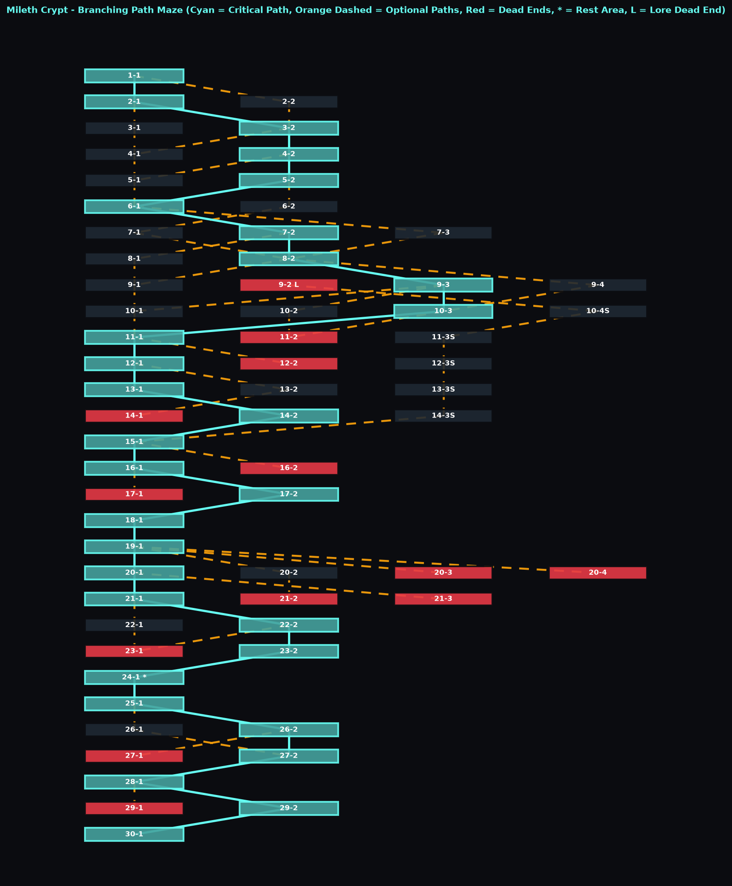
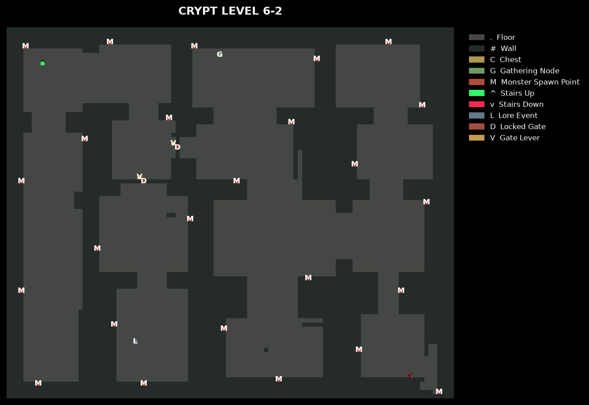

# Mileth Crypt Generator

A procedural, branching crypt generator that builds a multi-floor room graph, individual room maps, and an interactive browser-based map.

## Demo

Click either image to open the generated interactive map. From the overview, click a room to open it; hover over rooms to trace stair connections. In room maps, use the mouse wheel or zoom controls to zoom, and drag to pan.

[](output/dungeon_map.html)

### Generated Room Example

This is the secret lore room, reached by descending five floors and then ascending from the lower route.

[](output/dungeon_map.html)

## Setup

Requires Python 3.9 or newer. Dependencies are listed in [requirements.txt](requirements.txt).

### Windows PowerShell

```powershell
py -m venv .venv
.\.venv\Scripts\python.exe -m pip install -r requirements.txt
.\.venv\Scripts\python.exe render_dungeon.py
```

### macOS or Linux

```sh
python3 -m venv .venv
source .venv/bin/activate
python -m pip install -r requirements.txt
python render_dungeon.py
```

The script generates a 30-floor dungeon by default, saves the overview and individual room images under `output/`, and opens `output/dungeon_map.html` in your browser.

## Output

- `output/dungeon_map.html` - interactive room browser with clickable overview rooms, stair-connection highlights, room maps, gate controls, and gathering-node details.
- `output/data.json` - versioned, renderer-independent dungeon graph and full room tile/feature data for Unity or other consumers; see [json_schema.md](json_schema.md).
- `output/maps/overview_map.png` - static overview of the generated room graph.
- `output/levels/room_*.png` - rendered image for each generated room.

The generated dungeon includes branching paths, a specially gated lore dead end reached by descending five floors and then ascending, a small spawn-free resting area, and monster spawn markers distributed by room size.
